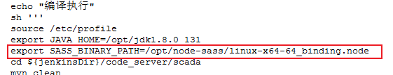

# Linux

##### 清理Linux环境缓存（buffer、cache）

echo 1 > /proc/sys/vm/drop_caches
echo 2 > /proc/sys/vm/drop_caches
echo 3 > /proc/sys/vm/drop_caches

##### 查看端口号

netstat -nap |grep '端口号'	显示端口号是否被使用
lsof -i:'端口号'			显示端口号是否被使用，并且显示使用该端口号的进程的PID
netstat -nap |grep 进程ID		可以通过进程ID查看端口号

##### nohup后端不挂断执行命令

nohup 命令 &（注意后面有一个&符号，此命令是不中断在后台运行）
例如：nohup sh startAgent.sh &

nohup ./doDBA -c doDBA.conf -mysql > out.log 2>&1 &

##### 查看cpu核数

lscpu

##### ps 命令展示进程cpu、内存消耗情况

ps -aux --sort -pcpu,+pmem | head -n 10	展示所有进程中cpu、内存消耗最多的10个
ps -aux --sort -pcpu | head -n 10		展示所有进程中cpu消耗最多的10个
ps -aux --sort -pmem | head -n 10		展示所有进程中内存消耗最多的10个
ps -aux --sort -pcpu | less			根据 CPU 使用来升序排序

##### 查看某个进程下有多少个线程

pstree -p 进程ID | wc -l

##### 批量替换某个目录下所有文件中的某个字符

~~~linux
sed -i "s/old/new/g" `grep old -rl 目标目录`

sed -i "s/192.168.108.160/192.168.108.159/g" `grep 192.168.108.160 -rl /home/hxdms/tomcat-8080/alarmconf`
~~~

##### 在某个目录下搜索中含有某个字符的所有文件名

grep old_pattern -rl 目标目录

##### 查看某个目录下各个文件的大小

du -h --max-depth=1		查看各个**目录**的大小
du -ah --max-depth=1		查看目录下所有**文件**的大小

##### 查看cpu消耗情况

~~~linux
sar -u [ <时间间隔> [ <次数> ] ]
~~~

如果想要查看系统 CPU 的整理负载状况，每 3 秒统计一次，统计 5 次，可以执行如下命令：

sar -u 3 5

# 性能

##### linux 性能分析工具sar

​	`sar`（System Activity Reporter 系统活动情况报告）是目前 Linux 上最为全面的系统性能分析工具之一，可以从多方面对系统的活动进行报告，包括：文件的读写情况、系统调用的使用情况、磁盘 I/O、CPU 效率、内存使用状况、进程活动及 IPC 有关的活动等。

​	`sar`命令来自于`sysstat`工具包，如果提示`sar`命令不存在，需先安装`sysstat`。

~~~
语法：sar (选项) (参数)

选项：
    -A：显示所有的报告信息；
    -b：显示I/O速率；
    -B：显示换页状态；
    -c：显示进程创建活动；
    -d：显示每个块设备的状态；
    -e：设置显示报告的结束时间；
    -f：从指定文件提取报告；
    -i：设状态信息刷新的间隔时间；
    -P：报告每个CPU的状态；
    -R：显示内存状态；
    -u：显示CPU利用率；
    -v：显示索引节点，文件和其他内核表的状态；
    -w：显示交换分区状态；
    -x：显示给定进程的状态。
    
参数：
    间隔时间：每次报告的间隔时间（秒）
    次数：显示报告的次数
~~~

http://c.biancheng.net/view/6212.html

##### 性能监控工具

nmon

执行命令

./nmon_x86_64_centos7	直接在Linux界面显示服务端的各项性能指标
./nmon_x86_64_centos7 -f -s 2 -c 600 -m /home/hxdms/monitor/Nmon/collect_data/	将服务端的各项性能指标保存到csv文件中

##### 环境Java进程占用资源过多如何定位

1.查找进程
top查看进程占用资源情况

2.查找线程
使用top -H -p <pid>查看线程占用情况

3.查找java的堆栈信息
将线程id转换成十六进制
#printf %x 15664---十进制
#3d30---十六进制

然后再使用jstack查询线程的堆栈信息
语法：jstack <pid> | grep -20 线程id（十六进制）

https://blog.csdn.net/lcczpp/article/details/113501121

# Jenkins

创建流水线任务时的tag的选项标签没有参数原因

从已存在的job拷贝出一个job进行构建

注意将pipeline下的顶层的定义的Jenkins环境变量指定为实际执行节点环境的Jenkins工作目录

不同节点进行编译job时，注意binding的路径和版本是否需要改变

通过pipeline将包部署到云外环境上
云内找一台服务器，从jfrog下载需要的安装包（云内从jfrog上下载需要给服务器申请凭据）
申请跨云传输权限，从云内服务器传输到云外服务器
通过云内服务器远程操作云外服务器进行部署

jenkins任务名称和pipeline脚本里的目标路径要完全一致!

1、一般节点只能从节点上打包编译成功后将包上传到jfrog服务器上。
目前只有node5节点可以将包从jfrog下载下来。
同时node5可以云内云外互通，然后node5也已经和ess的灰度环境做了免密传输互通

2、从jfrog上下载测试包可以参考以下两个job

3、Jenkins上下载包的pipeline语法

