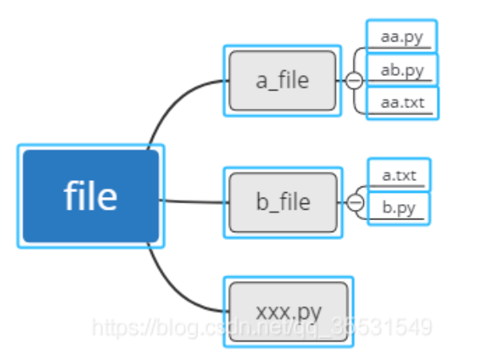

# 接口自动化

## 一、Python基础

interpreter：解释器，Python中一般用的解释器为CPython，是Python程序运行的环境

package：代码一般放到包里，包里有一个初始化文件，`__init__.py`

模块即Python文件，模块名即Python文件名，字母与数字以下划线分隔开

注释：#，注释单行 ctrl+/，注释快捷键，"""....."""，注释多行

数字：整型，浮点型

布尔值：True，False

### 1、字符串

* 字符串里的元素：单个字母，单个符号都算一个元素。且元素索引正序从0开始，反序从-1开始

* 列表里的元素根据“，”来确定元素个数，列表的子元素均为字符串类型
* 字符串支持切片

#### 1.字符串的切割函数

​	字符串.split("指定的分割符"，指定切割次数-默认为1)，分割符被切走不再存在。

#### 2.字符串的替换

​	字符串.replace（old，new，指定替换次数）

#### 3.字符串去除指定字符

只能去除首尾两处的字符，只作用于首尾。字符串.strip（指定字符-默认为空格）

#### 4.字符串的拼接

​	+，保证+号两边的数据类型要一致。

#### 5.数据类型的强制转换

​	目标数据类型（原数据）

#### 6.查询字符串中的子字符或子字符串

​	find（"子字符或子字符串"），如若存在，返回子字符所在的索引。若存在多个子字符，则返回第一个索引。找不到不存在子字符，返回-1.

#### 7.字符串切片

```python
s = "hello,world!"
n = s[1,5,2]
print(n)  # el,
```


#### 8.字符串的格式化输出

1. <u>.format()</u>，特点用{}来占位

   ```python
   age = 4
   name = 'panda'
   print("{}岁的{}在爬".format(age, name))
   print("{1}岁的{0}在爬".format(name, age))
   ```

2. %，特点用%来占位

   %s——字符串，可以填任何类型数据

   %d——只能是数字整型，如若是浮点型数据则会被强制转换成整型。

   %f——浮点数，%.2f即代表保留两位小数

#### 9.type(对象)，输出对象的数据类型，或者`对象.__class__`，同理

### 2、列表list[]

* 可以存在空列表，列表可以存储任何类型的数据，用“，”分割每个元素。
* 当存储同一类型的数据时建议用列表
* 列表索引从0开始
* 列表支持切片

#### 1.列表追加元素

​	list.append（），在列表末尾追加元素，每次只能追加一个

#### 2.列表插入数据

​	list.insert（索引值，插入元素），可以在列表的任意位置插入元素

#### 3.列表删除元素

1. list.pop（索引值），默认删除最后一个元素，被删除的元素会返回回来，可以用一个变量接收
2. list.remove（元素值），根据列表中的元素值来删除元素

#### 4.列表修改元素

​	list[索引] = 新值，赋值运算

#### 5.swapcase()函数，将字符串的大写转为小写，小写转为大写。

​	s='Hello'，swapcase(s)：hELLO

#### 6.字符串的映射translate()

* 先用maketrans()方法制作一个映射表
* 再利用translate()方法进行映射

~~~python
s = 'hello, world'
intab = 'elod'
outtab = '1234'
trantable = s.maketrans(intab, outtab)
s.translate(trantable)  # h1223,w3r24
~~~

#### 7.列表转为字典

~~~python
s1 = ['key1', 'key2']
s2 = ['value1', 'value2']
result = dict(zip(s1,s2))  # {'key1':'value1', 'key2','value2'}
~~~


### 3、元组tuple（）

* 元组可以包含任何类型的数据，可以存在空元组（）
* 元组支持切片，索引从0开始
* 元组不能进行任何的修改（增、删、改）
  * a =(1, 2, "panda", [1, 4])，a\[3][0\]=8，这样就能更改为a =(1, 2, "panda", [8, 4])
  * 元组本身的元素不能更改，可以将元组里面的列表元素修改，字符串不可以
* 如果元组结构的数据只有一个元素，那么必须加“，”。（‘panda’，）

### 4、字典dict{}

* 字典内部结构key:value，key键必须是唯一的。元素之间用“，”分隔
* 字典的value，可以存放任意类型的数据

#### 1.字典取值

​	字典名[key]

#### 2.删除字典元素

​	字典名.pop(key)

#### 3.字典新增元素

​	字典名[新key] = value

#### 4.字典修改元素

​	字典名[老key] = value

### 5、运算符

* 加+、减-、乘*、除/、模%。模运算-取余运算，一般用来判断奇偶的问题
* 赋值运算，=
* 比较运算，>，<，>=，<=，!=，==。返回结果布尔值
* 逻辑运算，and，or，not。返回结果布尔值
* 成员运算符，in，not in。返回结果布尔值。
  * 对于字典只能判断key是否存在于字典中

### 6、函数

#### 1.判断语句 if

​	一个条件语句里面，只能有一个if，一个else且else后面不能跟条件。

```
if 条件：
	子语句
elif 条件：
	子语句
.
.
.
else:
	子语句
```

#### 2.input（）函数

​	从控制台获取数据，且获取的数据都会被转换为字符串str类型

​	s = input（“提示信息”）,用变量s来接收

#### 3.random，随机数

* 可以利用random模块随机生成手机号码

​	random.randint(a, b)，生成[a, b]的随机整数

​	random.random()，生成（0，1）的随机浮点数

​	random.uniform(a,b)，生成[a, b]的随机浮点数

​	random.choice(序列)，序列指字典、列表、元组

​	random.randrange(a, b, c)，a=开始，b=结束，c=步长。从指定递增的范围内随机取一个数

​	

#### 4.for 循环

​	for 循环中“in”的作用，遍历可迭代类型数据的元素，一个个的遍历获取然后赋值给变量

* 对字典名进行遍历时，遍历的是字典的Key。s = {'name':'panda', 'age':4, 'sex':'man'}, for i in s:
* 遍历获取字典中所有的key值，for i in s.keys:
* 遍历获取字典中所有的value值，for i in s.values:

~~~python
li = [1, 2, 3, 4]
for i in li:
	print(i)
~~~

#### 5.range(首, 尾, 步长)函数

​	首：默认为0。步长：默认为1.

​	生成一个整数序列，取头不取尾。range(1, 5, 1)=1,2,3,4

#### 6.zip函数

~~~python
s1 = ['key1', 'key2']
s2 = ['value1', 'value2']
result1 = dict(zip(s1,s2))  # {'key1':'value1', 'key2','value2'}

result2 = list(zip(s1,s2))  # [('key1','value1'),('key2','value2')]。返回一个列表嵌套了元组，列表中第i个元组是原列表中第i个元素组合而成。

~~~


### 7、自定义函数

* 关键字，def 函数名（参数）。

#### 1.参数

1. 位置参数

   def func(n, m, k):

   赋值：func(1, 2, 3)

2. 默认参数

   def func(n, m=1, k = 0):	默认参数要放在位置参数后面。

   赋值：func(2, k=3)，当默认参数有值不需要重传时，可以直接给后面的默认参数赋值

3. 动态参数（*args），在不确定传入几个参数时使用。

   def func(*args)

   *args，代表是一个不定长参数，但在函数体中利用这个参数时则不需要加“\*”，引用变量时直接用变量名args即可。

   赋值：func(1, 3, 4, 5)

   动态参数在字典中体现为元组结构

4. 关键字参数（**kwargs）

   def func(**kwargs)：

   赋值：func(name = 'panda', age = 4, sex = 'boy')	或者	dict1 = {"name":'panda', 'age':4, 'sex'='boy'}，func(**dict1)

   关键字参数在函数中体现为字典结构。

#### 2.变量

1. 全局变量

   整个模块都能用这个变量

2. 局部变量

   函数体内部的局部变量，只能作用于函数

* 两者在于作用范围不一样
* 当两者同时存在且同名，优先使用局部变量。当局部变量不存在时，则使用全局变量。
* 在函数体内部若要使用全局变量，需在函数体内使用之前，先声明函数体内的变量是全局变量。global   全局变量名
* 多层函数嵌套，可以使用“nonlocal  变量名”，来使用并修改外层函数变量

#### 3.函数调用

​	def func(): ....

​	func()：函数名后加()，调用的是函数的执行结果，需要等待该函数执行完成。

​	func：函数名后不带()，调用的是整个函数体，调用的是一个函数对象，不用等待函数执行。

### 8、文件操作

#### 1.open(文件路径, mode)

返回一个文件实例对象file

mode：打开文件的模式——r, w, a, r+, w+, a+。默认打开方式r只读

当向文件中写入中文时，可添加参数encoding = 'gbk'/'utf-8'。Python写入文件不支持自动换行。必须手动输入换行符。

1. file.read()：读取文件中的所有内容
2. file.readline()：按行读取
3. file.readines()：多行读取文本内容，并保存在列表中
4. file.writelines()：写入多行，以列表形式写入，file.writelines(['13', 'panda'])

#### 2.文件相对路径

“/”：表示根目录，在windows系统下表示某个盘的根目录，如“E:\”；
“./”：表示当前目录；（表示当前目录时，也可以去掉“./”，直接写文件名或者下级目录）
“../”：表示上级目录。



xxx.py想要打开a.txt：./b_file/a.txt

ab.py尝试打开b_file下的a.txt：../b_file/a.txt


### 9、os模块

1. os.mkdir(目录名)：在当前项目路径下新建一个目录/文件夹。此方法不允许递归跨级的创建目录。

2. os.mkdirs(路径)：用于递归的创建目录

3.  os.rmdir(目录)：删除目录，必须一层一层的删除，不支持递归。

4. os.removedirs(目录)：支持递归删除目录，某个目录下的所有文件目录全被删除

5. os.remove(文件)：删除文件

6. os.getcwd()：获取当前文件的工作路径，返回的路径不包括文件本身，只到上一级目录。

7. os.path.realth(路径/文件)：返回文件的绝对目录

   * os.path.realth(`__file__`)：输出当前文件的绝对路径

8. 拼接路径（+，join）

   * new_path = os.getcwd() + '\path'+'\python'

     os.mkdirs(new_path)

   * join，连接。new_path = os.path.join(os.getcwd(), *args)

9. os.path.isdir(路径)：判断是否为目录。os.path.isfile(路径)：判断是否为文件

10. os.path.exists(绝对路径)：判断文件/目录是否存在。

11. os.walk(top[, topdown=True[, onerror=None[, followlinks=False]]])

    - **top** -- 是你所要遍历的目录的地址, 返回的是一个三元组(root,dirs,files)。
      - root 所指的是当前正在遍历的这个文件夹的本身的地址
      - dirs 是一个 list ，内容是该文件夹中所有的目录的名字(不包括子目录)
      - files 同样是 list , 内容是该文件夹中所有的文件(不包括子目录)
    - **topdown** --可选，为 True，则优先遍历 top 目录，否则优先遍历 top 的子目录(默认为开启)。如果 topdown 参数为 True，walk 会遍历top文件夹，与top 文件夹中每一个子目录。
    - **onerror** -- 可选，需要一个 callable 对象，当 walk 需要异常时，会调用。
    - **followlinks** -- 可选，如果为 True，则会遍历目录下的快捷方式(linux 下是软连接 symbolic link )实际所指的目录(默认关闭)，如果为 False，则优先遍历 top 的子目录。

    ```python
    import os
    for root, dirs, files in os.walk(".", topdown=False):
        for name in files:
            print(os.path.join(root, name))
        for name in dirs:
            print(os.path.join(root, name))
    ```

### 10、异常处理

1. try:

   ​	未报错，执行的动作语句

   except  错误类型:   				  # 错误类型可以为Exception（所有错误类型的基类）

   ​	报错，执行的动作语句								# 或者写具体的错误类型例如TypeErr或者直接不写错误类型。

   ​	

2. try:

   ​    未报错，执行的动作语句

   except：

   ​	报错，执行的动作语句

   findally:

   ​	无论报错与否，都要执行的动作语句。

   

3. try:

   ​    未报错，执行的动作语句

   except：

   ​	报错，执行的动作语句

   else:

   ​	和try下的未报错代码同步，try执行，else执行。

4. try:

   ​	未报错，执行的动作语句

   except  Exception as e:   				  

   ​	报错，执行的动作语句	

   ​	raise e   # 将错误释放出来。raise下方的代码不再执行，findally除外。

### 11、类与对象

1. 命名

   * 关键字—class

   * 类名：首字母大写，驼峰命名
   * 类：一套模板概括出这类事物拥有的共同属性和共同方法。

2. 实例

   * 类实例化：对象名 = 类名（）
   * 实例拥有类里面所有属性和方法的使用权限。调用类下的实例方法：对象名.方法名（）。调用类下的属性：对象名.属性

3. 属性

   * 同一个类中，在类下方法中调用类属性：self.属性名
   * 不同类中，不同文件(模块)调用类属性：类名.属性名

4. 方法

   类中调用属性和方法：self.属性名，self.方法名

   1. 实例方法

      实例方法必须带有self这个形参。self代表实例本身，相当于占位符。我们在通过实例调用这个方法是不需要传入这个实参，但是Python会自动将我们的对象也就是实例给传入，以此才能调用这个方法。

      ~~~python
      class Teacher():
          
      	def coding(self, a, b):
              print("***")
      Teacher().swimming(1, 2)  # 通诺实例调用实例方法
      ~~~

   2. 类方法

      类方法必须带有cls这个形参。cls代表类本身。

      ~~~python
      class Teacher():
      
      	@classmethod
      	def swimming(cls):
      		print("***")
      Teacher.swimming()  # 可以直接通过类名调用类方法。也可以通过实例调用。
      ~~~

   3. 静态方法

      静态方法就是一个普通函数。和在类外创建的函数一样。

      ~~~python
      class Teacher():
      
      	@staticmethod
      	def swimming():
      		print("***")
      Teacher.swimming()  # 可以直接通过类名调用类方法。也可以通过实例调用。
      ~~~

   4. 三者不同点

      * 三种方法均可通过实例名和类名直接调用
      * 静态方法和类方法不能调用类里的属性
      * 静态方法和类方法常用在函数和其他函数\属性没有关系时

   5. 类中的实例方法可以相互调用

      ~~~
      class Teacher():
          
      	def coding(self, a, b):
              print("***")
              
           def swimming(self):
           	self.coding('panda', 4)
      ~~~

      

5. 初始化函数`__init__`

   ~~~python
   def __init__(self, a, b):  # a,b是类在实例化时需要传入的参数
   	self.a = a  # self.a是实例变量。可以让类下的实例方法进行调用。相当于扩大了变量的作用域。
   	self.b = b
   
   ~~~

   * 初始化函数里面可以有默认值参数
   * 每个实例都自动调用初始化函数
   * 每次创建一个实例，需要传递对应的且个数一指的实参
   * 初始化函数可以有形参也可以无形参
   * 形参赋值给实例变量：self.变量名 = 形参

6. 类的继承

   父类：class  One():

   子类(继承类)：class  Two(One):

   * 子类是否需要写初始化函数，关键看父类是否已写。
   * 父类拥有的属性和方法，均可以被子类调用
   * 子类与父类具有相同的函数且函数名相同——重写。子类创建的实例优先调用子类的方法，父类创建的实例只能调用父类的方法
   * 子类中的方法在父类中不存在——拓展

   多继承

   多继承，继承多个父类，且父类之间不能有继承关系。

   class  Three(One, Two):

   * 具有两个父类的属性和方法，调用时采用就近原则

   * 若两个父类具有相同的方法名是，就近原则。One近，Two远
   * 需要注意：括号中父类中的顺序，若是父类中有相同的方法名，而在子类使用中未指定，python从左至右搜索方法。

### 12、python的内置函数

#### 1、all()函数

* all() 函数用于判断给定的可迭代参数 iterable 中的所有元素是否都为 TRUE，如果是返回 True，否则返回 False。
  元素除了是 0、空、None、False 外都算 True。

  ~~~python
  name = 'panda'
  age = None
  data = [name, age]
  if all(data) is None:
  	print("****")
  ~~~


#### 2、encode()和decode()函数

* 以指定的格式对字符串进行编码和解码，默认编码格式为“UTF-8”
* **字符串在Python内部的表示是unicode编码**，因此，在做编码转换时，通常需要以unicode作为中间编码， 即先将其他编码的字符串解码（decode）成unicode，再从unicode编码（encode）成另一种编码。
* **decode的作用是将其他编码的字符串转换成unicode编码**，如str1.decode('gb2312')，表示将gb2312编码的字符串str1转换成unicode编码。
* **encode的作用是将unicode编码转换成其他编码的字符串**，如str2.encode('gb2312')，表示将unicode编码的字符串str2转换成gb2312编码。
* 总得意思:想要将其他的编码转换成utf-8必须先将其解码成unicode然后重新编码成utf-8,它是以unicode为转换媒介的 如：s='中文' 如果是在utf8的文件中，该字符串就是utf8编码，如果是在gb2312的文件中，则其编码为gb2312。这种情况下，要进行编码转换，都需要先用 decode方法将其转换成unicode编码，再使用encode方法将其转换成其他编码。通常，在没有指定特定的编码方式时，都是使用的系统默认编码创建的代码文件


#### 3、isdigit()方法

- 检测字符串是否只由数字组成，如果字符串只包含数字，则返回true，否则返回false。

  **str.isdigit**()


#### 4、startswith() 方法

* 用于检查字符串是否是以指定子字符串开头，如果是则返回 True，否则返回 False。如果参数 beg 和 end 指定值，则在指定范围内检查。

  ~~~python
  str.startswith(str, beg=0,end=len(string));
  - str -- 检测的字符串。
  - strbeg -- 可选参数用于设置字符串检测的起始位置。
  - strend -- 可选参数用于设置字符串检测的结束位置。
  ~~~


#### 5、json数据

* json.dumps 用于将 Python 对象编码成 JSON 字符串。

* json.loads 用于解码 JSON 数据。该函数返回 Python 字段的数据类型。

  


### 13、离线安装库

#### 1.pip离线更新安装

1. 在python第三方库官网，将pip的离线安装包*.whl下载到本地，保存在python.exe的目录下
2. 在此目录下执行cmd命令：python -m pip install --upgrade xxx(pip轮子的文件名) 。完成安装

#### 2、离线安装第三方库

1. 将第三方库的离线安装包*whl保存至python的lib目录
2. 命令行窗口用cd命令跳转到whl文件所在目录，然后使用命令pip install ***.whl即可完成whl文件的安装。
   1. 或者在whl文件所在目录执行python setup install *.whl  


## 二、接口

### 1、基础

#### 1.协议

* 接口的本质：传递数据的通道

* 接口分为：内部接口，外部接口
* 按照不同的协议分为：http接口，webservice接口，dubbo接口，socket接口
* 接口与接口之间的协议必须保持一致，否则无法通信
* http请求分为：get（从服务端获取资源）、pos（用于创建资源，提交表单data、提交请求体body-json）、delete（用于删除资源）、put（用于整体更新资源）、head、option

#### 2.请求

一个http request（请求）是指从客户端到服务端的消息。

包括：请求地址、请求方法、http协议版本、请求头、请求参数（请求正文）

get请求的请求参数存在于URL中，“？”后面为参数，&为参数之间的分隔符。

#### 3.返回码

200：正常，状态码200不一定代表操作成功

302：重定向，请求的资源文档已被迁移的别处

304：未修改，客户端的缓存是最新的，客户端应该继续使用它

403：禁止，服务器理解请求，但禁止处理（一般为权限不够）

404：未找到资源，服务器上没有客户端请求的资源

500：内部服务器错误

503：服务器当前不处理

504：超时

#### 4.cookie、session、token、key

1. cookie

   客户端，存储一些用的数据，比如浏览记录

   cookie是登陆成功后获得的，登录失败是没有cookie的

   cookie ！=（不等于）缓存cache，cache包括cookie

   会员卡机制：session_id存在于cookie中，每次请求，cookie中的所有信息都会传递到服务器，服务器通过session_id来判断是否为同一用户

2. session

   服务端，记录用户的请求状态。一般默认时间30min过期。是变化的。

3. token 鉴权

   服务端发给客户端，每次请求再发给服务端验证。变化的。

   用来判断访问的接口是否正常、是否非法访问、是否绕过前端

4. key 授权

   一般key唯一的、全局的、动态的、具备一定的特征。

   用来判断是否具有访问接口的权限。

5. http

   http响应正文（报文）格式：html（标签）、xml（标签）、json等

   请求头与响应头后面的空行是必须的。

### 2、requests

* 官方文档：https://docs.python-requests.org/zh_CN/latest/

* Requests是Python语言的第三方的库，专门用于发送HTTP请求。
* Requests支持HTTP连接保持和连接池，支持使用cookie保持会话，支持文件上传，支持自动响应内容的编码，支持国际化的URL和POST数据自动编码。
* Requests会自动实现持久连接keep-alive，现代，国际化，友好。

#### 1.requests模块之get请求

1. get请求参数解析。   requests.get(url, params=None, **kwargs)

   * url：请求url地址
   * params：请求参数
   * headers：请求头(在kwargs中)

2. 简单使用

   - 获取响应状态码: res.status_code
   -  获取响应消息: res.content
   -  获取请求头: res.request.headers
   -  获取响应头: res.headers
   -  获取响应数据 res.text。响应结果一般有三种格式：html、json、text；

   - 获取cookie res.cookies。cookie是一种类字典的数据格式，若想打印字典的值，可以根据key；

   -  res.json()：如果返回结果是json格式，可以把响应结果利用json()来进行解析;


#### 2.requests模块之post请求

1. post请求参数解析。requests.post(url, data=None, json=None, **kwargs)

   * url，必填
   * data，选填，请求参数
   * json，选填，请求参数
   * kwargs，选填，可以传入headers、cookies等

2. 请求参数，data和json的区别

   * 不管是json是str还是dict，如果不指定 headers中的content-type，默认为application/json
   * data为dict时，如果不指定content-type，默认为applicaton/x-www-form-urlencoded，相当于普通form表单的形式
   * data为str时，如果不指定content-type，默认为application/json

3. post请求参数到底是传data还是json，这时候我们要看请求头里的content-type类型

   1. 如果请求头中content-type为application/json,  为json形式，post请求使用json参数。

   2. 如果请求头中content-type为application/x-www-form-urlencoded，为表单形式，post请求时使用使用data参数。

   3. 如果请求类型为application/json，我偏要传入data参数呢？

      * 清楚中传入请求头，header = {"content-type":"application/json"}
* 需要将字典类型数据转换为json字符串。

#### 3.requests模块之session请求

1. 作用以及应用场景
   * requests.session的作用：自动处理cookie，即 **下一次请求会带上前一次的cookie**
   * requests.session的应用场景：自动处理连续的多次请求过程中产生的cookie

2. requests.session使用方法

   * session实例在请求了一个网站后，对方服务器设置在本地的cookie会保存在session中，下一次再使用session请求对方服务器的时候，会带上前一次的cookie

   * session对象发送get或post请求的参数，与requests模块发送请求的参数完全一致

     ~~~python
     session = requests.session() # 实例化session对象
     response = session.get(url, headers, ...)
     response = session.post(url, data, ...)
     ~~~

     

#### 4.cookie和session的应用

* HTTP 协议是一种无状态协议，即每次服务端接收到客户端的请求时，都是一个全新的请求，服务器并不知道客户端的历史请求记录；Session 和 Cookie 的主要目的就是为了弥补 HTTP 的无状态特性。

1. cookie

   * cookie是服务器发送到用户浏览器并保存在本地（客户端）的一小块数据，它会在浏览器下次向同一服务器再发起请求时被携带并发送到服务器上。通常，它用于告知服务端两个请求是否来自同一浏览器，如保持用户的登录状态。

   1. cookie的应用

      ~~~python
      import requests
      
      # 登录接口
      url = 'http://127.0.0.1:8000/user/login'
      payload = {
          "mobilephone":"1530272****",
          "pwd":"123456"
      }
      login_res = requests.post(url,data=payload)
      print(login_res.json())
      # 获取响应结果的cookies
      cookies = login_res.cookies
      print(cookies)
      
      # 充值接口
      url = 'http://127.0.0.1:8000/recharge'
      payload = {
          "mobilephone":"1530272****",
          "amount":100
      }
      # 充值接口请求时携带cookies
      recharge_res = requests.post(url,data=payload,cookies=cookies)
      print(recharge_res.json())
      ~~~

      

2. session

   * Session是存放在服务器端、用来存放用户数据的（类似于HashTable结构）。
   * 当浏览器第一次发送请求时，服务器自动生成了一个HashTable和一个Session ID用来唯一标识这个HashTable，并将其通过响应发送到浏览器。
   * 当浏览器第二次发送请求，会将前一次服务器响应中的Session ID放在请求中一并发送到服务器上，服务器从请求中提取出Session ID，并和保存的所有Session ID进行对比，找到这个用户对应的HashTable，以此来达到共享数据的目的。

   1. session的应用

      ~~~python
      import requests
      
      # 登录接口
      url = 'http://127.0.0.1:8000/user/login'
      payload = {
          "mobilephone":"1530272****",
          "pwd":"123456"
      }
      # 创建session会话管理
      session = requests.session()
      login_res = session.post(url,data=payload)
      print(login_res.json())
      
      # 充值接口
      url = 'http://127.0.0.1:8000/recharge'
      payload = {
          "mobilephone":"1530272****",
          "amount":100
      }
      recharge_res = session.post(url,data=payload)
      print(recharge_res.json())
      ~~~

      


#### 5.Token

1. token的作用

   为了验证用户登录情况以及减轻服务器的压力，减少频繁的查询数据库，使服务器更加健壮。

2. 什么是token

   Token是服务端生成的一串字符串，以作客户端进行请求的一个令牌，当第一次登录后，服务器生成一个Token便将此Token返回给客户端，以后客户端只需带上这个Token前来请求数据即可，无需再次带上用户名和密码。

3. Token和 Cookie、Session 的选型

   对于只需要登录用户并访问存储在站点数据库中的一些信息的中小型网站来说，Session Cookies 通常就能满足。如果有企业级站点，应用程序或附近的站点，并且需要处理大量的请求，尤其是第三方或很多第三方（包括位于不同域的API），则 token显然更适合。

4. token的获取与使用

   1. 访问登录接口，获取token

      ~~~python
      import requests
      url = 'http://127.0.0.1:8000/user/login/'
      payload = {
          "username":"vivi",
          "password":"123456"
      }
      login_res = requests.post(url,json=payload)
      # 从响应结果中获取token值
      token = login_res.json()["token"]
      print("token:", token)
      ~~~

   2. 项目列表携带token访问

      * token前面加一个前缀，然后将token加在请求头里发起请求

        ~~~python
        mport requests
        url = 'http://127.0.0.1:8000/projects/'
        # 拼接最终的token，注意中间有个空格
        token = "Bearer" + " " + token
        headers={
            "authorization": token
        }
        pro_res = requests.get(url,headers=headers)
        print(pro_res.json())
        ~~~

        

      

## 三、单元测试

### 1、unittest框架

1. 概述

   TestCase()——编写测试用例模块需要继承，TestSuite()——测试用例容器，TestLoader()——测试用例加载器，TextTestRunner()——测试用例执行器，初级测试报告。assert——断言比对实际结果。HTMLTestRunnerNew()第三方生成html测试报告的测试用例执行器

2. 编写测试用例

   * 测试用例类必须继承unittest.TestCase()类。
   * 一条用例就是一个函数，每个用例名/方法名必须以"test_"开头。
   * 每个测试用例不能有任何参数，只有一个self

3. 测试用例执行前环境准备和执行完成后环境清理

   * def setUp(self)——初始化环境，该测试类下的每一条测试用例执行前，先自动执行这个函数
   * def tearDown(self)——清理环境，该测试类下的每一条测试用例执行完成后，自动执行这个函数
   * def setUpClass(cls)——整个测试用例类执行前执行一次这个函数。必须用@classmethod装饰
   * def tearDownClass(cls)——整个测试用例类执行结束后执行一次这个函数。必须用@classmethod装饰

4. 加载测试用例

   * 有三种方式可以往测试用例容器里添加用例
     * 逐条添加测试用例，一条测试用例添加一次
     * 根据测试用例类来添加测试用例
     * 根据测试用例文件（模块）添加测试用例

5. 执行测试用例

   * 执行测试用例的时候，unittest是根据测试用例名称的ASCII码排序来执行的。
   * 如果想固定测试用例的执行顺序，可以在测试用例名定位test_0\*\*，test_1\*\*

6. 断言assert

   * 用于判断用例是否执行通过，编写在测试用例中。self.asserEqual（first, second,msg=None）

     * fist——期望值，second——实际结果，msg——用例执行失败触发

   * 断言语法

     | 语法                  | 释义              |
     | --------------------- | ----------------- |
     | self.assertEqual(a,b) | 判断a,b是否相等   |
     | assertTrue(x)         | 判断x是否为真     |
     | assertFalse(x)        | 判断x是否为假     |
     | assertisNotNone(x)    | 判断x是否不为空   |
     | assertisNone(x)       | 判断x是否为空     |
     | assertNotEqual(x)     | 判断a,b是否不相等 |
     | assertin(a,b)         | 判断a是否属于b    |
     | assertNotin(a,b)      | 判断a是否不属于b  |

   * 断言时经常需要进行异常处理

     ~~~python
     try:
     	self.assertEqual(1,n,'断言失败')
     excep AssertionError as e:
     	print('断言失败')
     	raise e  # 当在异常处理时，若报错，必须将异常抛出，否则无论断言是否成功都不会通过
     ~~~

     

## 四、数据处理

### 1.测试用例之间相互依赖

例如：第二条测试用例需要用到第一条测试用例的结果，返回报文等

* 将第一条测试用例写在setUp函数中
* 将第一条测试用例的执行结果保存在全局变量中
* 利用反射，创建一个反射类，将第一条测试用例的执行结果保存在反射类中

### 2.测试用例的参数化

#### 1.超继承父类TestCase的`__init__`方法

~~~python
class TestHttp(unittest.TestCase):
    def __init__(self,methodName,url,method,data,expected):
        super(TestHttp,self).__init__(methodName) #利用超继承从而进行参数化
        self.url=url
        self.method=method
        self.data=data
        self.expected=expected
    def test_api(self): #测试用例本身不能传入参数
        res=HttpRequest().http_request(self.url, self.method, self.data,getattr(GetData,'cookie'))
       
~~~

#### 2.ddt装饰器装饰测试用例

1. ddt模块包括三个部分：ddt，data，unpack
   * ddt——测试类的装饰器
   * data（*args）——测试用例函数的装饰器。拿到几组数据就执行几次用例。
   * unpack——针对data拿到的每组数据再根据“，”进行拆分，并且必须在测试用例函数除出入同等个数的参数。

### 3.openpyxl处理Excel模块

​	form openpyxl import load_workbook

​	注意：Excel中的数据除数值为int或float类型外，其他数据结构读取出来都变成了str类型。可以利用eval()函数将读取出来的数据还原成字典、列表、元组等原结构。

* 打开Excel文件，wb=load_workbook('file_name')
* sheets = wb.get_sheet_names()，返回Excel文件中所有的sheet表单名，存储在列表中返回
* 定位到某个sheet表单， ws=wb['sheet_name']或者wb.get_sheet_by_name('sheet表单名')
* 定位到某个单元格，ws.cell(行，列)。注意行、列的索引是从1开始的。1即第一行或第一列。
* 取值，result=ws.cell(行，列).value。
* 行数，ws.max_row。列数，ws.max_column。


### 4、ddt+unittest+excel

* 在利用ddt修饰测试用例之后，在往容器里加载测试用例时必须通过loader加载用例方法进行。一条一条的添加用例的方式不可行。


### 5、configparser模块处理配置文件

* 以properties、ini、config结尾的均为配置文件	

* 配置文件分为三部分：section、option、value。注意：section在配置文件中必须以**大写形式，且用[section]中括号包围**

  ~~~python
  from configparser import Configparser
  cf = Configparser()
  cf.read('file_name', encoding='utf-8')
  cf.get(section, option)  # 获取option的value
  cf[section][option]  # 获取option的value
  cf.sections()  # 获取文件中的所有section
  cf.items(section)  # 获取section下的所有option、value。类字典格式
  cf.options(section)  # 获取section下所有的option，返回列表格式
  ~~~

  

### 6、pyMsql模块处理MySQL数据库

```python
import pymysql
#建立数据库连接
db = pymysql.connect(host="数据库地址",
                     user="用户名",
                     password="密码",
                     port=3306,# 端口
                     database="数据库名",
                     charset='utf-8')

cursor = db.cursor()  # 创建游标

query_sql='select * from emp'
cursor.execute(query_sql)  # 执行query_sql的sql语句

res=cursor.fetchall()  # 使用fetchall() 方法获取多条数据。
res=cursor.fetchone()# Python查询Mysql使用 fetchone() 方法获取单条数据

db.commit()  # 提交事务

cursor.close()  # 关闭游标

db.close()  # 关闭数据库连接

```


### 

# UI自动化

## 一、web基础

### 1、web页面组成

* web页面由三部分组成：html、css、JavaScript
  * html：定义页面呈现的内容
  * css：层叠样式表，控制网页如何展示、页面布局等，比如：字体颜色、大小、
  * JavaScript：对网页做一些动态的设置，希望网页依据不同的情形做不同的事情。

### 2、HTML

* HTML是一种超文本标记语言，具体知识学习http://www.sz-seo.org/w3cschool/html/index.html
* HTML独立于平台和编程语言
* HTML是一个树形结构

### 3、DOM对象

* DOM是一套web标准，Document Object Mode。定义访问HTML文档的一套属性、方法、和事件
* DOM对象本质：网页和脚本语言沟通的桥梁。脚本语言通过DOM对象来访问HTML页面，改文档的结构和内容
* 当浏览器载入HTML文档后，它就会成为document对象。document对象也是一个树形结构。

#### 1、DOM对象查找元素

* 通过元素的id属性：document.getElementById(id值)
* 通过元素的class属性：document.getElementsByClassName(类值)
* 通过元素的标签名：document.getElementsByTagName(标签名)
* 通过元素的Name属性：document.getElementsByName(name属性值)

#### 2、DOM对象对元素操作

* DOM对象通过查找元素定位以后，可以对元素进行操作

1. 改变元素属性：

   document.getElementById('78').属性名="新值"

   document.getElementsByClassName('ment').属性名="新值"

2. 获取属性

   document.getElementBy***("  ").getAttribute("属性名")

3. 移除属性

   document.getElementBy***("  ").removeAttribute("属性名")

4. 改变元素内容

   1. 包含HTML元素标签即有后代的情况

      document.getElementBy***("  ").innerHTML = newHTML。（将原定位的元素内容替换为新的页面newHTML）

   2. 不含HTML元素标签即没有后代的情况，直接改变文本的内容

      document.getElementBy***("  ").innerText = newText。（将新文本赋值改变文本原来内容）

      注意：有时文本内容不存储在innerText属性中，而是存储在value属性中

5. 改变样式css

   document.getElementBy***("  ").style.样式名 = 新的样式值

   实例：document.getElementBy***("  ").style.visibility = ’hidden’

6. 事件

   * 浏览器和用户事件，触发之后执行js代码带来不同的页面响应。

   1. 页面加载完成事件（一般写在最后）

      ~~~
      window.load = function(){
      	alert('everything is ready')
      }
      ~~~

      

   2. 点击事件

      ~~~
      document.getElementBy***("  ").onlick=function(){
      	,,,,,,,
      }
      ~~~

      

   3. 鼠标悬停事件

      ~~~
      document.getElementBy***("  ").onmouse=function(){
      	,,,,,,,
      }
      ~~~

      

   4. 鼠标离开事件

      ~~~
      document.getElementBy***("  ").onmouseout=function(){
      	,,,,,,,
      }
      ~~~

      


### 4、JavaScript


## 二、selenium

### 1、常见driver操作

* 启动浏览器开启会话：driver = webdiriver.Chrome('驱动地址')
* 访问网页：driver.get('http://www.baidu.com')
* 结束会话，关闭浏览器：driver.quit()，彻底杀死进程
* 关闭打开的浏览器窗口：driver.close()，注意此举并没有杀死进程
* 窗口最大化：dirver.maximize_window()
* 设置窗口的大小：driver.set_window_size(self, width, height, windowHandle='current')
* 回退上一页：driver.back()
* 回到上一页，前进：dirver.forward()
* 刷新：driver.refresh()
* 获取标题：driver.title
* 获取网址：driver.current_url
* 窗口句柄：driver.current_window_handle

### 2、元素定位

* 元素定位成功后，可以获取元素的属性，或者进行实践操作
* find_element_by_id/xpath（元素定位表达式）等方法底层是find_element（定位类型，定位表达式）


#### 1、常见定位方式

* 注意下面的driver.find_element**s**\***方法用来匹配多个符合定位表达式的元素，最终返回一个匹配的webelement对象列表。

  1. 通过属性id定位

     ele=driver.find_element_by_id('id属性值')；元素定位成功后返回的ele是一个webElement对象

     ele.get_attribute('class')；获取属性值

  2. 通过class定位

     * 当class属性有多个值是，只能选一个值作为实参，入参

     driver.find_elements_by_class_name('class属性值')

     driver.find_element_by_class_name('class属性值')

     3. 通过name属性

     driver.find_elements_by_name('name属性值')

     driver.find_elements_by_name('name属性值')

     4. 通过tagname标签名

     driver.find_elements_by_tag_name('标签名')

     driver.find_elements_by_tag_name('标签名')

     5. 通过链接a的文本内容

     driver.find_elements_by_link_text('文本内容')；通过文本的全部内容定位。

     driver.find_elements_by_partial_link_text('部分文本内容')；通过文本的部分内容定位。

#### 2、万能定位方式Xpath

* 在UI界面，F12后Ctrl+F，输入xpath定位表达式辅助定位即可。
* driver.find_element_by_xpath(xpath表达式)

1. 相对定位的xpath表达式

   * 以"//"开头，不依赖页面的顺序和位置，只看整个页面有没有符合表达式的元素
   * 绝对定位：以**/**开头，非常依赖页面位置和顺序

   ~~~python
   //标签名[@属性=‘值’]  # 单个属性定位
   //标签名[@属性=‘值’ and @属性=‘值’]  # 通过多个属性定位
   //标签名[@属性=‘值’ or @属性=‘值’]
   
   ~~~

   

2. 层级定位的xpath表达式

   ~~~python
   //标签名[@属性名=‘值’]//标签名[@属性名=‘值’]
   ~~~

   

3. 通过text（）函数进行文本定位

   ~~~python
   //标签名[text()=“文本内容”]  # 此处的文本内容必须用双引号括起来
   //标签名[@属性名=‘值’]//标签名[text()="sjdfj"]
   ~~~

   

4. 通过contains（）函数进行部分文本、部分属性值进行元素定位

   * contains(@属性，’值‘)
   * contains(text(), “值”)

   ~~~python
   //input[contains(@class,'username') and @id='32']//*[@id='99']	
   ~~~

5. 模糊定位

   ~~~python
   //标签名[starts-with(@属性名，‘属性值’)]  # 以。。。开始的元素
   //标签名[ends-with(@属性名，‘属性值’)]  # 以。。。结束的元素
   ~~~

   

#### 3、轴定位

| 轴名称            | 描述                                       |
| ----------------- | ------------------------------------------ |
| ancestor          | 祖先节点                                   |
| parent            | 父节点                                     |
| child             | 子节点                                     |
| preceding         | 当前元素节点标签之前的所有节点             |
| preceding-sibling | 当前元素节点标签之前的所有兄弟（同级）节点 |
| following         | 当前元素节点标签之后的所有节点             |
| following-sibling | 当前元素节点标签之后的所有兄弟（同级）节点 |

* 轴定位语法

  ~~~
  /轴名称：：节点名称[@属性=’值‘]  # 绝对定位方式。节点名称即标签名
  //span[text()="python"]/ancestor::a/following-sibling::div//a
  ~~~


#### 4、特殊元素的定位

* web界面有一种情况，弹窗一闪而过，出现很短时间，然后就消失。如何定位：

  F12，选择sources工具，弹窗元素出现后，立即点击暂停pause。然后进入Elements定位元素。


### 3、元素等待

#### 1、强制等待

* 利用time.sleep（）模块

#### 2、隐性等待

* 利用implicitly_wait（时间）
* 设置最长元素等待最长时间，在这个时间内加载完成，则执行下一步。
* 整个driver的会话周期内，设置一次即可，全局通用。

#### 3、显性等待

* 利用webDriverwait类（显性等待类）、expected_conditons类（期望条件类）、By类（元素定位类型类）组合实现

* 明确等到某个条件满足之后再执行下一步操作

* 程序每隔**秒查看一下，如果条件成立，则执行下一步，否则继续等待，直到超过设置的最长时间，然后抛出“TimeOutException"

  webDriverWait(driver，最长等待时长，轮训周期).until（成立条件）/until_not(否定条件)

  expected_conditons类提供了一系列期望发生的条件：

  ​	presence_of_element_located：元素存在

  ​	visibility_of_element_located：元素可见

  ​	element_to_bi_clickable：元素可点击

* WebDriverWait(driver, 10, 0.5).until(EC.presence_of_element_located((定位类型, 定位表达式)))

* 实例

  ~~~python
  from selenium import webdriver
  from selenium.webdriver.support.wait import WebDriverWait
  from selenium.webdriver.support import expected_conditions as EC
  from selenium.webdriver.common.by import By
  
  driver = webdriver.Chrome()
  WebDriverWait(driver, 10, 0.5).until(EC.presence_of_element_located((By.ID, 'id属性值')))  # 定位表达式必须以元组格式传入。
  ~~~


### 4、iframe切换

* 当对html页面进行元素操作时，如果操作元素为iframe元素（另一个HTML页面）下，注意需要先切换至iframe下。
  * 先找到要切换的iframe
  * 再切换
  * 再定位元素

#### 1、iframe切换方法一

* 切换iframe代表进入另一个HTML页面
  * driver.swith_to.frame(name的属性值)
  * driver.swith_to.frame(索引值-从1开始计算)
  * driver.swith_to.frame(通过元素定位表达式定位返回的**webelement对象**)

#### 2、iframe切换方法二

* 通过元素显性等待至iframe元素出现，然后同时切换过去

  ~~~python
  from selenium.webdriver.support import expected_conditions as EC
  
  WebDriverWait(driver, 10, 0.5).until(EC.frame_to_be_available_and_switch_to_it((定位类型, '定位表达式')))
  
  ~~~

#### 3、iframe其他操作

* 从iframe页面切换默认页面（访问网页默认加载的页面）

  driver.switch_to.default_content()

* iframe页面只能一级一级的切换

* html页面切换至上一级页面

  driver.switch_to.parent_content()


### 5、窗口切换

* 思路
  * 目前有多少窗口打开
  * 窗口句柄是什么
  * 找到句柄切换过去

* 最新打开的窗口，句柄在返回的列表最后
* 显性等待新的窗口出现
  * WebDriverWait(driver, 10, 0.5).until(EC.new_window_is_opened(入参为未打开新窗口之前的句柄数))

#### 1、获取窗口句柄

~~~python
handles = dirver.window_handles  # 获取目前窗口总数，返回一个句柄列表
hanle = driver.current_window_hanle  # 获取当前窗口的句柄
~~~


### 6、Alert弹框

* alert不是html元素
* 弹出框分两种
  * 页面弹出框：等待弹出框出现后，再去定位弹框，然后在操作弹框元素
  * Windows弹出框（alert弹框）

#### 1、切换至弹框

* driver.switch_to.alert

#### 2、操作弹框

* alert类提供了弹框的操作方法

  * dismiss（）：点击否，拒绝
  * accept（）：点击是，接受
  * text（）：获取弹框内的内容
  * send_keys（）：往弹框内输入内容

* 显性等待弹框出现

  * WebDriverWait(driver, 10, 0.5).until(EC.alert_is_present（）)。这注意alert的等待条件不需要输入参数

* 实例

  ~~~python
  driver = webdriver.Chrome()
  driver.get('网址')
  WebDriverWait(driver, 10, 0.5).until(EC.alert_is_present（）)  # 显性等待弹框出现
  alert = driver.switch_to.alert  # 切换至弹框
  alert.accept()  # 相当于鼠标点击弹框“是”
  
  ~~~

  

### 7、常见元素操作

* 针对元素定位成功后的后续常见操作
* 当对鼠标操作传入一个webelement对象参数时，则会在该对象处进行操作，不传入参数时，则在鼠标当前位置进行操作。
  * 模拟鼠标点击：click（）
  * 往文本框发送文本：send_keys（）
  * 清空文本框信息：clear（）
  * 提交表单/模拟回车：submit（）

* webelement对象的四个基本操作
  * driver.find_element_by_xpath(“***“).click()
  * driver.find_element_by_xpath(“***“).send_keys('文本信息')
  * driver.find_element_by_xpath(“***“).text()  # 获取文本信息
  * driver.find_element_by_xpath(“***“).get_attribute('属性名')

### 8、鼠标操作

* 由selenium的ActionChains类来完成模拟鼠标操作
  * from selenium.webdriver.common.action_chains import ActionChains
* 流程
  * 以列表形式存储鼠标操作
  * 利用perform（）执行操作

#### 1、ActionChains类支持的操作

​	double_click()——双击；context_click（）——右击；drag_and_drop（）——拖拽，相当于鼠标左键按住然后拖动到另一区域释放；mover_to_element（）——鼠标悬停；。。。。。。


### 9、下拉框操作

* 操作下拉框两种方案
  * 先通过文本内容定位，然后操作
  * 先获取所有下列表值，再利用for循环匹配，操作

#### 1、select类

* select类是专用于处理select/option 标签下拉框
  * from selenium.webdriver.support.ui  improt select
* 如何通过select类定位下拉框中的元素？
  * 通过下表选择：select_by_index(索引值-从0开始计算)
  * 通过value属性：select_by_value(value属性值)
  * 通过文本内容：select_by_visible_text(文本内容)


### 10、键盘操作

* 通过Keys类和send_keys（）来实现模拟键盘操作
  * from selenium.webdriver.common.keys import Keys
* 键盘也可以利用pywin32来实现模拟

#### 1、组合键

* Keys.CONTROL相当于ctrl键

​	复制：send_keys（Keys.CONTROL，"c"）

​	全选：send_keys（Keys.CONTROL，"a"）

​	剪切：send_keys（Keys.CONTROL，"x"）

​	粘贴：send_keys（Keys.CONTROL，"v"）

​	。。。。。。


#### 2、非组合键

​	回车键：send_keys（Keys.ENTER）

​	删除键：send_keys（Keys.BACK_SPACE）

​	空格键：send_keys（Keys.SPACE）

​	制表键：send_keys（Keys.TAB）


### 11、执行JavaScript

#### 1、滚动滚动条

* 当页面中的元素不在可见区域内时，需要滚动条操作。滚动条不是HTML页面中的元素，是浏览器利用JavaScript实现。
* 利用JavaScript实现滚动滚动条

1. scrollIntoView()参数为Boolean型参数，传入false,移动WebElement对象至与当前窗口的底部对齐

   driver.execute_script("arguments[0].scrollIntoView(false);", WebElement对象)

2. scrollIntoView()参数为Boolean型参数，传入true.默认值为true,移动WebElement对象至与当前窗口的顶部对齐

   driver.execute_script("arguments[0].scrollIntoView();", WebElement对象)

3. 滑动滚动条至页面底部
   driver.execute_script("window.scrollTo(0,document.body.scrollHeight)")

4. 滑动滚动条至页面顶部
   driver.execute_script("window.scrollTo(0,0)")

5. scrollIntoViewIfNeeded()方法也是用来将不在浏览器窗口的可见区域内的元素滚动到浏览器窗口的可见区域

   但如果该元素已经在浏览器窗口的可见区域内，则不会发生滚动。

   driver.execute_script("arguments[0].scrollIntoViewIfNeed(true);", ele)	#true为默认值，但不是滚动到顶部，而是让元素在可视区域中居中对齐；false时元素可能顶部或底部对齐，关键看元素靠哪边更近。


#### 2、日期输入框

日期输入框的input标签是readonly属性，然后又不想在弹出框中选择具体日期时，可以通过利用DOM更改元素的属性，使readonly的值由ture变为false然后就可以直接编辑输入日期了。

```python
driver = webdriver.Chrome()
driver.get("https://www.12306.cn/index/")
driver.maximize_window()

WebDriverWait(driver,10).until(EC.visibility_of_element_located((By.XPATH,"//input[@id='train_date']")))

#利用JavaScript(DOM对象)来修改readOnly属性的值，将readOnly的值变为false后，便可以进行编辑了
#或者也可以利用JavaScript(DOM对象)来移除readOnly属性，然后就可以进行编辑了
js = 'var ele = document.getElementById("train_date");ele.readOnly = false;ele.value = "2020-09-12";'
driver.execute_script(js)

driver.find_element_by_link_text('查    询').click()
```


### 12、上传操作

* 上传操作有两种情况：

  * 如果是input可以直接输入路径的，那么直接调send_keys输入路径。（如果input标签是readonly属性，可以利用“日期输入框”的方法先改属性再传值）
  * 非input标签的上传，则需要借助第三方工具（MAC/Linux--利用AutoIt,调用生成的au3或exe文件，python pywin3操2库，识别对话句柄，进行作）

* 利用pywin32模块和spy++工具来实现

  import win32gui 

  import win32con

#### 1、定位顶级窗口

win32gui.FindWindow(IpClassName, IpWindowName)
自顶层窗口开始寻找匹配条件的窗口，并返回这个窗口的句柄
IpClassName：类名
IpWindowName：窗口名（window caption）

#### 2、定位子级窗口

win32gui.FindWindowEx(hwndParent=0,hwndChildAfter=0,IpszClass=None,IpsWindow=None)
搜索类名和窗体名匹配的窗体，并返回这个窗体的句柄。找不到就返回0
hwndParent：若不为0，则搜索句柄为hwndParent的窗体的子窗体
hwndChildAfter：若为0，从第一个子窗体开始搜索，若不为0，则从索引为hwndChildAfter开始向后搜索子窗体
IpszClass：字符型的窗口类名
IpsWindow：字符型的窗口名

#### 3、执行上传操作

win32gui.SendMessage(hWnd,Msg,wParam,IParam)
hWnd:整形，接收消息的窗体句柄
Msg：整形，要发送的消息，这些消息都是Windows预先定义好的
wParam：整形，消息的wParam参数
IParam：整形，消息的IParam参数


## 三、Pytest

### 1、pytest概述

1. pytest的所有命令均在终端命令行执行
2. pytest是基于unittest之上的单元测试框架
3. 自动发现测试模块和测试方法
4. 断言使用 assert + 表达式即可
5. 可以设置会话级（session）、模块级（module）、类级（class）、函数级（function）的fixture，用于数据清理和准备工作
6. 有丰富的插件库

### 2、pytest收集测试用例规则

* 默认从当前目录下收集测试用例。即在哪个目录下运行pytest命令，则从哪个目录下收集
* 规则：
  * 测试用例文件命名规则：test\_*.py或\*_test.py
  * 测试用例函数以test_开头命名
  * 测试用例类以Test开头，并且测试用例类没有init函数。

### 3、对测试用例打标签

* 在运行测试用例时，可以根据标签名过滤测试用例
* 使用方法：
  * 在测试用例/测试类前加上：**@pytest.mark.标签名**。例如@pytest.mark.smoke
  * 可以在一个测试用例/测试类上加多个标签
* 单独执行带有某种标签的测试用例：pytest -m 标签名（在终端执行命令）


### 4、创建fixture方法

1. 在测试用例文件的同级目录下创建conftest.py。（必须和测试用例文件同级）

2. 在conftest.py中定义函数，并用**@pytest.fixture(scope=" 此fixture函数的作用域session、class、function等 ")**标记

3. 在测试用例方法、测试用例类中引用conftest.py中的fixture。

   * 注意在测试用例模块文件中引用fixture时，不需要将conftest.py文件导入。

   * 给需要用fixture的测试用例/测试类前直接标签标注。**@pytest.mark.usefixture("fixture函数名")**

4. 在conftest.py文件中，fixture函数里有“yeild"作为前置操作、后置操作的分割线。

   * yeild可以用来返回fixture函数中的变量、值，用元组/列表的形式返回。
   * 在测试用例函数中，加入形参-fixture函数名来接收返回值，以便后续调用

* conftest.py文件实例

  ~~~python
  import pytest
  
  driver = None
  @pytest.fixture(scope='class')   #声明此函数是一个fixture,参数scope代表此fixture的作用域。作用域为类。整个测试类只执行一次。
  def access_web():
      #前置操作
      global driver
      driver = webdriver.Chrome()
      driver.get(CD.web_login_url)
      lg = LoginPage(driver)
      yield (driver, lg)  #yield 分隔线，代表前置条件与后置操作的分隔，并且还用来返回（相当于return）变量参数
                          # 返回参数有的格式为元组或列表形式
      #后置操作
      driver.quit()
      
  @pytest.fixture(scope='function')   #作用域为每一个函数，每个函数均会执行一次本函数。
  def refresh_page():
      global driver
      yield  #yield不是不许存在的，当存在后置操作时则需要输入yield分割线
      #后置操作
      driver.refresh()
  ~~~

* 测试用例调用fixture实例

  ~~~python
  import pytest  #pytest和unittest不要放在一起用
  
  @pytest.mark.usefixtures('access_web')  #在运行测试用例的时候会先去运行access_web函数
  @pytest.mark.usefixtures('refresh_page')    #同理，类下面的每个函数都会执行这个fixture
  class TestLogin():
      # 传入需要接收返回值的fixture的函数名用来接收返回值。用fixture函数名称作为参数接收conftest.py文件中的函数的返回值。
      def test_1_login_success(self, access_web):
          # 步骤：输入用户名密码点击登录
          access_web[1].login(LD.success_data['user'], LD.success_data['password'])
          # 断言：页面中能否找到**元素,pytest中直接利用assert进行判断，后面表达式为Ture则返回Ture,False返回False
          assert IndexPage(access_web[0]).isExist_logout_element()
  ~~~

  

### 5、pytest、unittest

1. unittest中可以根据用例名称（含有数字，`_0_、_1_`）来决定用例加载执行顺序。否则用例执行时无序的。
2. pytest中只能通过用例的位置，即用例在文件中靠前就先执行，用例在文件中靠后就后执行。
3. pytest和unittest测试用例文件的加载顺序，可以通过给测试用例文件命名来决定。（test_01_login.py；test_02_invest.py）


### 6、pytest测试用例参数化

* 用于实现unittest中的ddt
* 在测试用例的前面加上：**@pytest.mark.paramertize('参数名'，‘列表数据’)**
  * 参数名：用来接收每一项数据，并作为测试用例数据
  * 列表数据：一组测试数据

~~~python
phone_data = [
    {"user": 1389045372123, "password": "iphone12", "check": "请输入正确手机号"},
    {"user": 13890453, "password": "iphone12", "check": "请输入正确手机号"},
    {"user": 111389045372, "password": "iphone12", "check": "请输入正确手机号"},
    {"user": "", "password": "iphone12", "check": "请输入手机号"},
    {"user": 1389045372123, "password": "", "check": "请输入密码"}
]

@pytest.mark.parametrize('data1', phone_data)    #pytest模块中不能使用ddt进行测试用例的参数化
def test_0_login_user_wrongformat(self, data1, access_web):
    # 步骤：输入用户名密码点击登录
    access_web[1].login(data1['user'], data1['password'])
    # 断言：页面中提示请输入正确的手机号
    assert access_web[1].get_errorMsg_from_loginArea() == data1['check']
~~~


### 7、pytest重运行机制

* rerunfailures

* 使用方式：

  pytest --reruns 次数，运行失败用来可以运行几次

  pytest --reruns 重运行次数  --reruns-delay 延时，延时是重运行之间的时间间隔

* 举例：pytest --reruns 2 --reruns-delay 5，表示失败的用例可以重运行2次，每次间隔时间为5秒


### 8、pytest生成测试报告

* 涉及到的路径均为相对路径

1. 生成JunitXml格式报告：--junitxml=path/文件名.xml——常用于dign
2. 生成result log格式报告：--resultlog=path/log.txt
3. 生成HTML格式报告：--html=report/t文件名.html


### 9、pytest-allure报告

* 安装插件，allure-pytest

* 查看allure的测试报告目录命令：

  allure	server	allure目录(绝对路径)——在cmd命令行执行

* 生成报告命令：pytest  --alluredir=相对路径(指定测试报告目录即可，不用像上面一样指定文件名)

* 


# APPUI自动化

## 1、Appium基础

* Appium，开源工具，用于自动化界面。可用于iOS手机、Android手机、Windows桌面上的移动web和混合应用。

### 1、应用分类

* 原生应用：用iOS、Android、Windows SDK编写的应用
* 移动web应用：移动端浏览器访问的应用（Appium支持iOS上的Safari，Chrome和Android上的内置浏览器）
* 混合应用：带有一个“webview”的包装器，比如微信上的（APP+公众号_网页），知乎，Android原生控件+网页web（其实就是HTML页面放在APP上）


## 2、移动端自动化框架

* ios9.3以上：XCUITest
* ios9.3以下：UIAutomation
* Android4.2以上：UIAutomator
* Android2.3以上：Instrumontation


## 3、Android设备相关命令

### 1、aapt命令

* 获取应用包名和入口activity

  aapt 	dump	badging	apk应用名（以apk为后缀）


### 2、adb命令

* adb用来连接安卓手机和PC端的桥梁

  | 命令                                                         | 描述                                                     |
  | ------------------------------------------------------------ | -------------------------------------------------------- |
  | adb  kill-server                                             | 关闭adb服务                                              |
  | adb  start-server                                            | 开启adb服务                                              |
  | adb  devices                                                 | 检测连接到电脑的安卓设备                                 |
  | adb  shell  logcat                                           | 打印log信息                                              |
  | adb  pull  <手机路径>  <电脑路径>                            | 从手机中拉取信息到电脑路径                               |
  | adb  push  <电脑路径><手机路径>                              | 从电脑上推送信息到手机上去                               |
  | adb  shell                                                   | 登录设备的shell（人机交互命令行），进入到Linux命令行环境 |
  | adb  shell  logcat  >  电脑文件路径                          | 将log信息重定向到本机文件中                              |
  | adb  install  **.apk                                         | 安装应用，也可以直接把apk包直接拖进cmd窗口中             |
  | adb  uninstall  包名（应用）                                 | 卸载APP                                                  |
  | adb  shell  dumpsys  activity名  \|  find  "mFocusedActivity" | 查看前台应用Activity名（当前设备活动的activity页面）     |
  | adb  connect/disconnect                                      | 通过WiFi进行远程手机调试                                 |
  | adb  kill-server/adb  start-server                           | 关闭/启动adb服务                                         |
  | adb  shell pm  list  packages                                | 列出所有的包名                                           |
  | adb  shell pm  list  packages  -f                            | 列出所有apk路径及包名                                    |
  | adb  shell pm  list  packages  -s                            | 列出所有系统apk路径及包名                                |
  | adb  shell pm  list  packages  -3                            | 列出用户apk路径及包名                                    |
  |                                                              |                                                          |
  |                                                              |                                                          |

  

## 4、元素定位

* 通过id定位：resrouce-id
* 通过class-name定位：classname
* 通过Accessibilityid定位：content-desc
* 通过AndroidUiAutomator定位：
* 通过Xpath定位（效率低下）

### 1、AndroidUiAutomator定位详解

* 通过UiAutomator中的Uiselector类来进行元素定位
* driver.find_element_by_android_uiautomator(Uiselector类定位元素表达式）

1. Uiselector类定位元素的表达（用java来写）

   注意java中，“	”来表示字符串，'	'来表示单个字符

   new	UiSelector().函数名(“定位表达式”).函数(“定位表达式”)……————Java语法

   new	UiSelector().resrouceid("com.xx2b.fenwoo:id/btn_login")


## 5、滑屏操作

* 滑屏接口：swipe（起始X，起始Y，结束X，结束Y）

  起始X——结束X：X轴滑动的距离

  起始Y——结束Y：Y轴滑动的距离

  

* 滑屏执行原理

  获得屏幕尺寸；设置滑动距离占屏幕比率；调用滑动接口

* 实例

  获得窗口的大小——get_window_size()；返回屏幕的宽和高

  设置滑动距离——X1=\*；Y1=\*；X2=\*；Y2=\*；

  调用接口——swipe（X1，Y1，X2，Y2）


## 6、触屏操作

* 利用TouchAction类，类似于selenium中的ActionChains类

  将一系列的动作放在一个链条中，然后将链条传送给服务器，server接受链条后，会解析，依次执行。

  

  | 命令             | 描述                           |
  | ---------------- | ------------------------------ |
  | press            | 短按                           |
  | longpress        | 长按                           |
  | tap              | 点击                           |
  | move  to  (x，y) | 移动到，相当于上一个坐标的距离 |
  | wait             | 等待                           |
  | release          | 释放                           |
  | perform          | 执行                           |
  | cancel           | 取消                           |
  |                  |                                |

  **注意：press、longPress会与release结合使用**

  **press，longPress可以传入element对象，也可以传入坐标**

  ~~~python
  ele = driver.find_element_by_id("***")
  ele.size  # 获取元素的尺寸，以字典的形式返回元素的尺寸，{’width':'**';'height':'**'}
  ori = ele.location  # 获得元素的起点坐标（元素的左上角）
  					# location方法返回元素的起点坐标，以字典的形式返回{’x':'**';'y':'**'}
  ~~~


## 7、Toast提示信息提取

* 在提取Toast提示信息之前，初始化服务器参数时必须指定自动化测试引擎（automationName）为UiAutomator2

  **版本高时，不需要指定会自动切换至UiAutomator2**

1. Xpath表达式——文本匹配

   appium中的text是元素的属性

   xpath=“//*[contains(@text,'部分文本内容‘)]”

2. 元素等待

   元素wait时，使用presence_of_element_located，不能使用visibility……，toast不支持


## 8、杂七杂八

### 1、如何分辨一个APP是Active还是web？

1. 开发者选项中打开显示布局边界，如果APP有边界显示则为Active，没有则为web

2. 通过UiAutomatoviewer定位，class属性值为webview***，则为web

   混合应用中的web移动网页和原生控件是不同的，不能通过UiAutomatoviewer来识别


### 2、hybird混合应用自动化方案

基于UiAutomator+ChromeDriver

### 3、获取webview页面的三种方式

通过Chrome://inspect,网页获取，需要翻墙

使用driver.page_source，获取HTML页面

找开发要源文件

使用uc-devtools工具获取


### 4、context

类似于web-selenium中的窗口，此处叫做上下文

列出所有可用的上下文：driver.contexts

列出当前的上下文：driver.current_context

切换至默认的上下文：driver.switch_to.context(None)

切换至指定的上下文：driver.switch_to.context(driver.contexts[-1])

当前的Activity：driver.current_activity

当前的包名：driver.current_package
